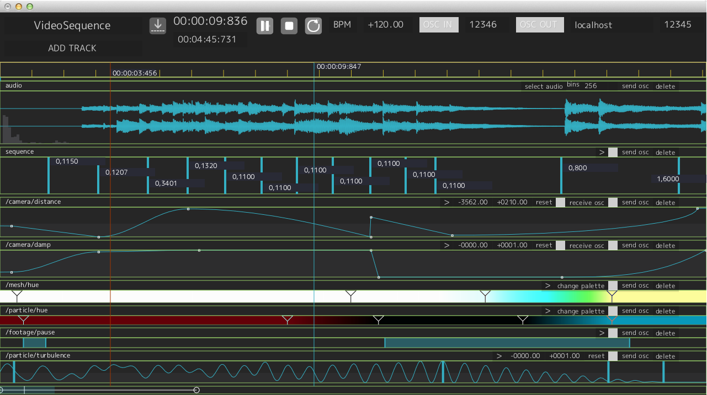



  

    Duration is a timeline for creative coding. Create live performances, interactive installations, and music visualizations by synchronously composing servos, lighting, and projection.
  

  

<!-- 

  <h3>Watch Tutorial</h3>
  
on Vimeo

  

-->

  

  
  
  
  

  
Duration integrates with <a href="http://processing.org">Processing</a>, <a href="http://cycling74.com/">Max</a>, <a href="http://vidvox.net/">VDMX</a>, <a href="http://openframeworks.cc">OpenFrameworks</a>, <a href="http://unity3d.com/">Unity3d</a>, <a href="https://developer.apple.com/technologies/mac/graphics-and-animation.html">Quartz</a>, and any other OSC enabled environment. 

